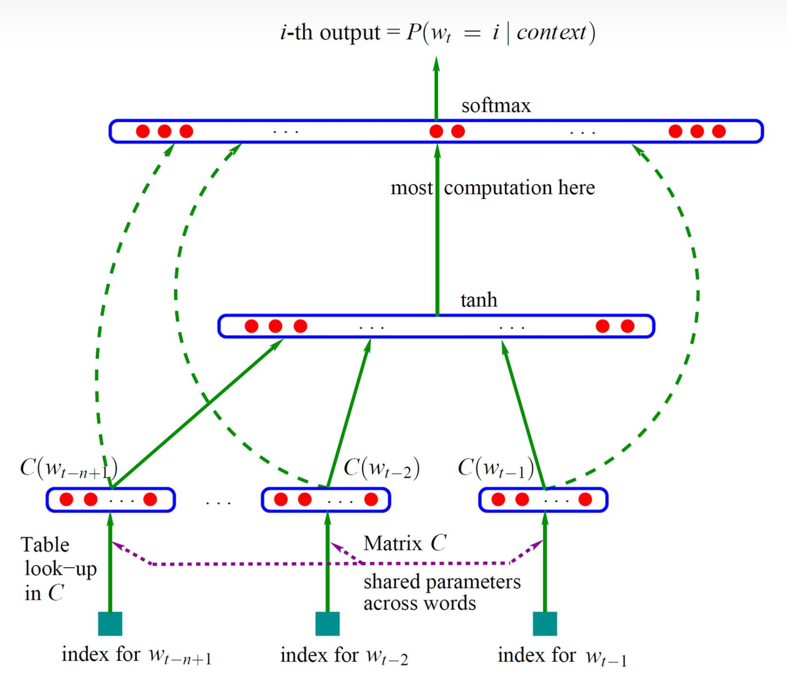

# 前言--我的懵逼时刻
作为一个学习大模型的新手，在看过一定数量的论文、博客、视频之后，我对一些词的意思很迷惑！Embedding，encoding，tokenization,encoder,one-hot encoding和embedding是否有关，tokenization中的encode和embedding是否相关，和transformer中的encoder是否有关，tokenization和embedding之间的关系是什么？说实话，我看的越多，我越疑惑。这还只是英文方面的字词。看了许多的中文博客，看到了词嵌入（embedding）,词向量(word2cvec)，文本token化（tokenization），文本向量化编码（encoding），编码（encoder）,解码（decoder），我更疑惑了。

有的博客会说，embedding(这里先特指NLP领域)是将文字表征为低维向量，所以从文字到向量的整个过程都是embedding在做吗？有的博客也会说，one-hot编码作为典型的文本向量化方法，将文字转化成编码；而论文也会讲，word2vec可以将学习文字间的关系，将文字表征成低维向量...等等等。我从这些博客里面学到了很多，但也积累了很多的问题，这么多仿佛都是在做一件事，将文字转成向量？one-hot编码是？embedding是？word2vec是？甚至于，transformer中的encoder是？

于是，我决定自己针对这个问题，好好做做功课，以笔记的形式梳理我的思路，记录我的理解。

# 问题聚焦
不仅是语言模型，还是其他模型。以现在主要的人工智能两大领域来说，NLP和CV，各种模型的结构、大小各不相同。但是，有一点不变的是，**模型是对数字矩阵或者向量等进行运算处理的**。那么模型在进行训练或者推理之前，第一步永远都是数据的处理————如何获得进入模型的入场券 **向量化数据**。

因此，这篇博客的主要内容就是在将，数据进入模型前的那些事。这里，我将主要内容放在embedding上，这里的embedding指的是广义的embedding，即如何将数据映射成一个能够表达数据内、数据间信息的低维稠密向量（或矩阵）。
整个博客主要解释以下几个问题：

- 文本向量化的概念是什么？有哪些不同的含义导致上述我的理解错乱？
- 不同文本向量化是不是都是从文字开始，到得到向量为止？
- 常说的NLP LLM相关的文本向量化流程是什么？
- CV领域的向量化有哪些？
- 其他的向量化代表有哪些？

# 阅读提要
根据问题，不难看出，我想从文字的向量化入手，然后转到图像方面，最后对其他的向量化过程进行总结。这里我为了分类方便，将文字的向量化部分统称为word embedding,图像向量化部分统称为image embedding,其他方面，主要介绍两种向量化应用：item embedding（对象向量化） 和 graph embedding（图网络向量化）。

# 博客开始
## Word Embedding
**首先我们来解决第一个问题**，*什么是文本向量化，文本向量化到底有哪些不同的含义？*

文本向量化，顾名思义就是，将文本用向量表示。那么表示有很多种意思，比如类似于键值对的表示方法，就像查字典一样，规定一个向量就表示一个文字或者字符。这种表示，是人为指定的表示，相互交换不同的键值，对文本的表示影响不大，只需要在文本对应的两个字符位置相互调换就行了，对其他的字符没有任何改变。这里这个向量的作用只是一个指针而已，上面所说的ont-hot encoding就是这样。我讲这种表示称为表层表征。

但是如果说，我需要这个向量能够反映不同文本间的关系，反映文本内容，那么这种表达方式做不到。

但在模型训练的时候，我们需要整个的向量不只是作为文本的一个指针，更需要向量能够传递出更多关于文本的信息，比如这句话的意思，两个词之间是否有关系等等。我们需要用向量来表达文本中的内容以及字符间的内在联系，那么这就需要另外一种向量化的方式。这里我认为这个才是word embedding。**这也解释了第二个问题的答案**。

而需要注意的是，我们进行word embedding并不是一步完成的，其实可以分为两步来完成：
- 首先找到文本的表层表征向量$\vec{X_1}$
- 利用不同的word embedding方法将这个向量映射成我们需要的地位稠密向量$\vec{X_{2}}$

可以看出，表层表征是word embedding的第一步。下面，我将依次介绍word embedding的整个过程中的关键过程及技术，**即解决第三个问题**，因为整个的技术就是按embedding的流程来进行的。
### 1 Tokenization
#### 1.1 tokenization作用
在想着如何将文字（或者语言或者其他）向量化之前，我们首先应该想到的是，组成一段话的字符是有很多个的，字符和字符的组合也是无数的。我们不可能以一段话为一个整体去分别生成一个对应的表层表征，那么我们应该如何去实现呢？想想英文中的26个字母，虽然英文中的字词多，组成的语句无数，但是基本的组成部分仍然是不变的，那么我们在进行一段话的表征时，不就是去表征各个字母的排列组合吗？那么只要我们将这些字母用向量或者数字进行表征后，整个的语句不就被表征完了吗？

因此，在NLP领域，对长字符串类型的数据，在embedding前进行的处理中，在进行表层表征的时候，首先要做的就是将一个长字符串分解成一个个的**容易被直接表征的组成单元**，而这些**容易被直接表征的组成单元**就被成为token。将长字符串分解成一个个单独的token的过程就称为tokenization（分词）。**但是需要注意的是**，tokenization做的不止这些，分解完之后的tokens还会在这一步进行表层表征，即输出的不再只是token的列表，而是一个向量。

> （这里解释一下，其实tokenization在我的认识里面也是**分为广义和狭义**两种的，狭义的tokenization就只是分词得到token列表，例如在**BertTokenizer**类中对应的函数就是*BertTokenizer.tokenize()*；而广义的tokenization还包括将token列表转化成向量，对应的函数为*BertTokenizer.encode()*,其功能与*BertTokenizer.tokenize() + BertTokenizer._convert_token_to_id()*类似，但也有点不同，那就是一些特殊符号，比如一句话的开始标志或者终止标志等，默认情况下，仅tokenize()函数是不会加入用来标注token在词语或者语句中位置的标志）。
> 
> 下面是一个示例：

```python
import torch
from transformers import BertTokenizer

sentence = 'i am songf,nice to meet you'

tokenizer = BertTokenizer.from_pretrained('bert-base-uncased')

# 分词和向量化分开
output_chars = tokenizer.tokenize(sentence)
print(output_chars)
output_tensor1 = tokenizer.convert_tokens_to_ids(output_chars)
print(output_tensor)

# 直接encode
output_tensor2 = tokenizer.encode(sentence)
print(output_tensor)
```

> 运行结果你会发现，两个函数生成的向量长度不同，原因是由特殊标志导致的。特殊标志是用来区分前后两个语句或者token在一个词内部的位置的。

#### 1.2 常见的分词方法
从token的组成部分来分，tokenization分词主要由三个level：
word-level, subword-level 和 char-level。

word-level很好理解，就是将单个的字词作为一个token，这种方式的好处是：分词简单，便于操作；但也存在劣势，容易出现OOV（out-of-vocabulary）问题，即如果出现一个词汇表中没有出现的新词时，很难找到对应的替代词，只能用‘UNK’来替代；假设词汇表中有'cat'这个词，但是没有'cats'这个词时，即使后者只是前者的复数，但利用word-level的tokenization无法发现两个词间的联系，这对于NLP来说是一个巨大的损失。

char-level就是将单个的字符作为一个token，这样的好处是任何的单词或者句子都可以表示，表示完整；例如将'i am sf'分解成['i',' ','a','m',' ','s','f']。

subword-level介于两者之间，学习语言中常用到的一些词或者词的一部分，例如'darkest'可以分成两个频率高的子词'dark'和'est'。这也是目前最常用的一种分词方法。

而在subword-level分词方法中，针对于如何来确定词汇表中的子词又有不同的方法，接下来我将主要介绍几种大模型中使用较为广泛的分词方法。

- **BPE(Byte-Pair Encoding)**

    使用这种分词方法的代表模型为GPT家族模型，其分词思想为：
    - 首先将输入语句中不同的单词隔开，在每个单词结束后加上一个单词结束符'< /w >';
    - 利用char-level的分词方法将所有的单词全部分成单字；
    - 将出现频率最高的单子合并；
    - 迭代上一步，直到结果满足条件（例如满足词汇库大小要求等）；
    
    对于可能出现的未在词汇库中的子词，用'< unk >'表示；
- **Word-Piece**
  
    word-Piece主要由Bert家族模型采用，其分词思想为：
    - 在一句话的句首添加'[CLS]',在两句话之间添加'[sep]'，'[CLS]'主要用在需要进行句子语气分类等场景下，放在句子开头，便于识别句子的类别；
    - 寻找出现最频繁的子词组合：认为两个单字出现概率和小于两个单字组成的子词出现的概率，则认为该子词出现频繁；
- **sentence-piece**
  
    这种方式的优势在于对多语言的兼容性。不同于直接对语句进行分词，其将不同语言的子词先行转化成unicode编码在进行分词，另外对一些格式字符进行转换。这一部分具体请参考[HeptaAI博客](https://zhuanlan.zhihu.com/p/631463712)

对tokenization源码感兴趣的朋友，可以学习[huggingface transformer](https://github.com/huggingface/transformers) *src/model/*中相应模型的tokenization方法。
#### 1.3 表层表征encoding
表层表征encoding就是将token转换成一一对应的向量或者矩阵的过程。其实利用数字来表示文字很常见，比如通信领域，利用01编码来表示文字。这些encoding中，数字和文字只是存在一一对应关系，但这个数字本身是和文字没有任何关系的，是人为给定的，因此称之为表层表征。

需要注意的是，不论什么编码形式，都是需要指定一一对应关系，那么就需要存储由这种一一对应关系的基本资源库存在。就像拿着货单取货一样，一个货号对应一件商品，你拿着货单总要到仓库里面才能取货。没有仓库这个货单也没有任何作用。

- **hashing encoding**
  
    hashing encoding就是利用hash方法进行的encoding方式，hash方法的特点是具有编码的单向性，可以将文字hash成一串数字，但数字反过来无法解码出文字，这也是密码学中经常用到的方法，但在语言模型中很少用到。

- **one-hot encoding**
  
    one-hot编码在模型训练中经常用到，其主要优势在于，给定词汇表后，每个token对应一个向量，这个向量中仅一位为1，其余为0，故为one-hot编码。但这种编码形式存在一个很大的问题，每个向量的长度都是词汇表的长度，而一句话会有很多个token存在，这些向量组成了一个很大的矩阵，存储信息十分稀疏，并不适合模型对其中信息的学习。于是有人将各个token向量相加而被并列，最终获得一个向量，将信息集中。这种方法将数据进行一定程度的压缩，但是其损失了token之间的次序关系，这一点在语句中是十分重要的。目前用one-hot编码的技术主要由word2vec。

- **index-based encoding**

    index-based encoding是目前使用最为广泛的一种表层表征的encoding方式。这种encoding方法要求tokenization时候形成的token词汇库满足以下格式：

    $$vacabs = \{ token1:0,token2:1,...\}$$
    
    将token当作key，每个token对应有自己的index。当将一句话进行tokenization后，依次寻找token对应的index，由此得到一个向量。

    同样这种方法也存在一个问题，那就是不同的语句的token量不同。因此每个模型其实在输入的时候都会严格的控制token数，以避免token数过多；而当token数过少时，则需要利用填充方法(padding)进行向量填充。

除上述encoding方法之外，还有很多其他的encoding方法，在此不一一赘述了。需要注意的是，不论什么encoding方式，最重要的是对应的词汇表。不同的词汇表意味着不同的映射关系，会导致同一句话的表层表征不同，对于模型来说，就意味着数据不同了。因此大家需要注意在模型微调等的时候，选择的tokenization方法和embedding方法最好来自同一模型的，这样一句话才能得到正确的表层表征（正确是相对于当前模型的embedding而言的），通过embedding才能得到对应的embedding向量表示。

### 2 word embedding method
这一部分主要参考两篇word2vec论文

[*Efficient Estimation of Word Representations in Vector Spac*e](https://arxiv.org/abs/1301.3781), 

[*Distributed Representations of Words and Phrases and their Compositionality*](https://arxiv.org/abs/1310.4546)

以及对两篇文章的数学理论解释论文

[*word2vec Parameter Learning Explained*](https://arxiv.org/abs/1411.2738)；

视频方面两个视频对我学习十分重要，分别是

[唐宇迪博士讲word2vec](https://www.bilibili.com/video/BV1MS4y147js/?spm_id_from=333.337.search-card.all.click&vd_source=c703137ad0da7405d35fd7d2acb5d905)；

[深度之眼论文导读](https://www.bilibili.com/video/BV1A7411u7zh/?spm_id_from=333.337.search-card.all.click&vd_source=c703137ad0da7405d35fd7d2acb5d905)

我下面所讲内容基本来自上面各位大佬，感谢各位大佬的无私奉献。
#### 2.1 N-gram model以及困惑度
自然语言处理在我看来，最核心的业务就是，说出人话。那么整个的产出‘人话’的过程，最直观的想法就是，从前往后。从最开始的语言处理算法来看，人们给出了一个数学上可信，实际上可行的方法。

在最初的语言处理过程中，都是以word作为基本的输入单元的，并没有太过复杂的tokenization。因此，在已知一句‘人话’的前i个单词$\{ x_1, x_2, ..., x_i \}$时，如何来预测第i+1个单词$x_{i+1}$呢，这个预测过程可以堪称时对词汇库中所有词可能出现的概率进行计算，然后拿出最大概率的值。那么如何来计算概率呢，这就出现了条件概率公式：
$$P(x_{i+1}|(x_1,...,x_i)) = \frac{P(x_1, x_2, ..., x_{i+1})}{P(x_{i+1})}$$


从上面的公式我们可以看出，第i个词的选择与前i-1个词息息相关，与前i-1个词的关系一同出现的概率越大，那么这个词被选择的概率就越大。
但是这也存在一定的问题。
- 首先是**新词问题**，如果有一个词在之前的语料库中没有出现过，那么就意味着分子为零，那么就会出错。为此，语言模型有了一系列的平滑操作，其中代表性的就是，**加一平滑**，即给每个词的出现次数默认加一，保证分子不会为零。
- 其次就是概率消失问题。这一点和深度网络中的梯度消失问题很像。因为一句话有n个词，那么每个词的出现概率都小于1，这导致，当预测的单词个数越来越多时，由于累乘方式的原因，单词的概率都会很低。为了解决这个问题，**N-gram语言模型**出现。

**N-gram模型是基于马尔可夫链假设建立的**，他认为第i个单词的预测至于前N个单词有关，当N为1是就是1-gram，N=3时就是3-gram。这也奠定了后面语言模型训练和运行的基调。公式如下：
$$P(x_i) = f(x_{i-N+1}, x_{i-N+2}, ..., x_{i-1})$$


同样，一个模型、一个任务的好坏评估需要一定的指标，在NLP领域，如何预测模型预测的句子的好坏，用的指标便是**困惑度**。公式如下：
$$PP(W) = P(w_1w_2w_3...w_N)^{- \frac{1}{N}}$$

一句话的困惑度越低，则说明这句话越好。指数$- \frac{1}{N}$主要用来消除句子长短对评估的影响。

#### 2.2 NNLM及RNNLM
NNLM模型作为利用神经网络训练词向量用于语言处理的先驱之作，其利用一个简单的神经网络来进行词向量的训练，利用N-gram范式进行NLP。




NNLM的整个流程可以概括为：
> 1建立词库--2单词ont-hot编码--3句子中前i-1个词投影矩阵变换并拼接--4全连接层W--5tanh激活函数--6隐藏层H--7softmax激活函数--8输出词库中每个单词的可能概率

用公式表示就是：
$$P(x_i) = Softmax[ \textbf{H}[tanh(\textbf{W}(concat(x_1,x_2,...,x_{i-1})) + b_1)] + b_2]$$

其实，上面所提到的投影矩阵(projection matrix)就是embedding的最早模样。embedding就相当于一个大表，里面有着词库中每个单词对应的词向量，通过ont-hot编码可以直接得到每个单词的词向量。但是在NNLM中，并没有将这个矩阵参数作为训练参数加入训练。

同样的RNNLM与上面的不同在于，RNNLM的输入有两部分，包含前i-1轮预测信息和单词信息的隐藏状态$h_{i-1}$和第i-1个单词$x_{i-1}$。其余部分并没有改变，模型演示图如下：


#### 2.3 word2vec
好了，说了这么多的前人智慧，我们终于来介绍了word2vec。在word2vec的首发论文中，主要提到三个成果：
- 提出能够在大规模数据中快速训练优质的词向量的算法-- word2vec；
- 提出两种实行的模型训练模式：CBOW和Skip-gram；
- 词向量好坏的评估方式；

因此，word2vec理论上并不是完完全全的走完了NLP的全部过程，他只是完成了每个词的向量化过程。word2vec模型，就是为了词向量化的。那么如何来训练这个word2vec模型呢？

让我们来思考一下一般的监督学习范式的要素，有数据，有标签。而我们这里，并不知道每个词应该对应的向量是什么，因此谈何标签，那么这个模型是怎么来进行训练的呢？这里就引出了下面两种训练方式。他们的基本思路就是，将词向量嵌入到NLP任务中，去进行训练。因为毕竟，词向量是为了NLP而生的。单独训练词向量不行，那么就将词向量嵌入到一个类似NNLM的模型中去训练。而NNLM模型的训练是可以知道标签的，loss函数的设计可以直接从困惑度入手，一切都可以解决。

而在后续发表的第二篇论文中，作者又提出了一些列的改进措施，能够提高word2vec算法的速度和准确性。这一部分我也会在后续提到，从中我们可以感受到作者的巧思和算法之美。

##### 2.3.1 CBOW实现
> CBOW:continuous bag of words,'continuous' represents distributed word representation, 'bag of words' infers the order of words in sentence is out of consideration.

CBOW的模型训练方式如图：

具体的流程可以概括为：
> 1 制作语料库 -- 2 制作训练数据 -- 3 one-hot编码 -- 4 查找embedding大表 -- 5 加和平均 -- 6 激活函数tanh -- 7 隐藏层 -- 8 softmax激活函数 -- 9 得到结果，计算损失，继续训练

这里，4和7步本质上都是矩阵运算过程。而这个矩阵本身，其实都可以看成是词向量embedding表。4处好理解，7处我们可以理解为，得到了前面的词的向量信息$s_{i-1}$，我们到中心词向量中去找到和向量$s_{i-1}$最为相关的向量，这个向量本应就是目标词的词向量。而整个的匹配过程，就是寻找向量和矩阵的每一列的内积结果最大值。

而这两个都可以作为embedding表，用的比较多的就是前面的embedding表。

##### 2.3.2 Skip-Gram实现
skip-Gram的训练过程正好和CBOW相反，过程如图：

从图上我们可以看出来，这种训练方式能够产生更多的数据，因此当训练数据较少时，通常采取的就是Skip-gram范式。

其流程和CBOW差不多，在这里就不多赘述了。

##### 2.3.3 优化方法
通过对word2vec的不同训练方法进行学习，我们可以发觉到，在softmax层，实际上我们做的是一个多分类问题。而到底有多少类呢————类别个数与语料库中词的个数相同！那么这可就太大了，softmax的计算压力很大！

那么有没有什么方法能够对整个的模型训练过程进行优化呢？从速度和准确度两个方面。速度方面主要就是减少softmax层的压力；准确度方面就是从语料库中的词的选择下手。

**hierarchical softmax**

hierarchical softmax 即层次softmax技术，以下简称H-softmax，其核心思想就是利用多个sigmoid来代替softmax,将复杂度从指数级将为线性的。在我看来，其实现方式和决策数很像，从并查集反过来变成一棵二叉树。请看下图。

本质上模型训练的过程是为了计算出各个词的概率。那么利用softmax就是先将所有词的概率都算出来然后找到最大的，这样的计算复杂度就是O(N)；而H-softmax的思想就是，不需要将所有的词的概率都计算出来，只需要设置一个阈值，当发现某个词的概率大于阈值时则说明就是这个词，不需要再计算其他的了。这就构成了一个决策二叉树模型，每次我都从两个中选择出一个。而这样还是会遍历所有的值，复杂度还是O(N);于是，哈夫曼树就出现了。这种带有权重的二叉树，将最有可能出现的词放在更靠近树根部的位置，极少出现的词放在树的叶子节点处。这样构建的哈夫曼树的复杂度就变成了$O(\log_{2}{N})$。这就是H-softmax最核心的知识。

而实际中，这个概率是怎么样计算的呢，以skip-gram为例，公式如下：
$$P_{\text{i step}} = sigmoid(\theta_i^Tx)$$
这里x是中心词在embedding中所查到的向量，$\theta_i$是第i步所对应的左节点的单词在周围词向量embedding表中所得到的向量，两个向量做内积之后得到的值经过激活函数就可以得到相应的概率了。

但其实这个地方存在一个问题就是，哈夫曼树的构建！哈夫曼树的构建影响着整个算法速度以及准确度，目前很少有谈到使用这项技术的。我也没有很多的深入，如果有兴趣请自行寻找更多的资料。

**negative sampling**

negative sampling即负采样，他的核心思想就是：减少softmax多分类的个数。原本的训练过程可以看作是从池子里面找目标的任务，而现在我将池子中的候选个数减少，这样不就ok了嘛。那么如何来实现这一目标呢，自己造一个小池子。我们将数据中的标签（即下一个词）拿出来，并再从语料库中随机拿出k-1个词作为负样本。训练的目标就是，希望预测当前这k个词的预测概率，我们希望的结果肯定就是，标签对应的概率最大。

这种方法使得softmax的计算复杂度从O(N)降到了O(k)，而N代表的是语料库中的单词个数，而k相对就小了很少。

**subsampling of frequent words**

##### 2.3.4 word2vec 小结
word2vec无疑是NLP领域的一大里程碑研究成果。word2vec主要用于词语的词向量生成，解决了早期NLP领域无法在大规模语料库上进行快速训练的问题，并且提供了优质的词向量表示，为NLP训练打开了一扇新的大门。

word2vec的训练方法主要有两种，CBOW和Skip-gram，这两种训练方式在后面也使用广泛。word2vec中还对训练过程进行了许多的优化，其中negative sampling在语言模型的训练中应用极为广泛。

word2vec是一个具有代表意义的word embedding技术。

## Image Embedding

## Item Embedding

## Graph Embedding


# Reference
